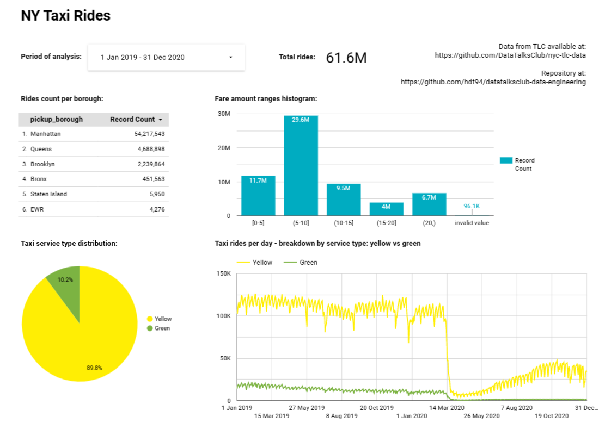

# Week 4: Analytics engineering with dbt

Guiding references:
- https://github.com/DataTalksClub/data-engineering-zoomcamp/blob/main/week_4_analytics_engineering
- https://github.com/Victoriapm/ny_taxi_rides_zoomcap
- https://github.com/DataTalksClub/nyc-tlc-data
- https://cloud.google.com/bigquery/docs/control-access-to-resources-iam#grant_access_to_a_dataset

## Setup
- default dbt schema (i.e. BigQuery dataset) used here is `rides_ny`

### GCP IAM permissions

Create a service account for dbt: https://cloud.google.com/iam/docs/creating-managing-service-accounts

Define environment variables:
```
export PROJECT_ID=
export DBT_SA=

export DATASET_DEV_NAME=rides_ny_dev
export DATASET_PROD_NAME=rides_ny_prod
```

Setting IAM permissions using:
- assign `roles/bigquery.jobUser` at project-level
- assign `roles/bigquery.dataEditor` and `roles/bigquery.user` at development and production datasets-level
- scripts requires `gcloud` and `bq` available
```bash
chmod +x init-dbt-access.sh
./init-dbt-access.sh
```

Note: consider that previous permissions are insufficient for a CI flow as it requires dbt service account to have permissions for creating temporary datasets (i.e. dbt schemas). Read https://docs.getdbt.com/docs/deploy/cloud-ci-job

### dbt cloud

- Setup dbt access credentials for BigQuery: https://github.com/DataTalksClub/data-engineering-zoomcamp/blob/main/week_4_analytics_engineering/dbt_cloud_setup.md
- Create a branch (e.g. `dbt-cloud`) distinct than main repository branch (`main` or `master`)
- Set project subdirectory in dbt cloud project settings (Account Settings > Projects) equal to repository subpath for cloud dbt
- Select created branch in dbt cloud IDE


## Load source data

Run `load_data_to_gs_bq.py` to load files into Cloud Storage and create source BigQuery tables used by dbt:
- running from Cloud Shell is recommended as it has lower latency
- `load_data_to_gs_bq.py` enforces data types of some integer columns to avoid mismatching between files once saved as Parquet files. Read doc string of script for further explanation.
- following datasets are loaded:
    - FHV data - Year 2019
    - Green taxi data - Years 2019 and 2020
    - Yellow taxi data - Years 2019 and 2020
```bash
# create python environment
python3.9 -m venv venv
source venv/bin/activate

# define env vars
PROJECT_ID=
BQ_SOURCE_DATASET_NAME=
GS_BUCKET_NAME=

# run script
python load_data_to_gs_bq.py \
    --bq-dataset-id="${PROJECT_ID}.${BQ_SOURCE_DATASET_NAME}" \
    --bucket-name="$GS_BUCKET_NAME"
```


## Working with dbt
- All staging models are configured as views

Running models:
```bash
dbt run --var 'is_test_run: false'

dbt build --select stg_fhv_trips+ --var 'is_test_run: false'
```

dbt job configuration:
- Command: `dbt build --var 'is_test_run: false'`


## Looker Studio (Data Studio)

Public dashboard: https://lookerstudio.google.com/reporting/a63a144a-99cf-40b6-aa0c-affa3334f914


